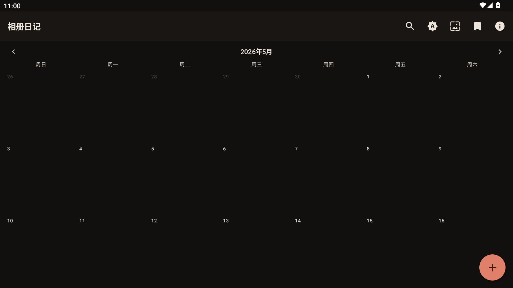
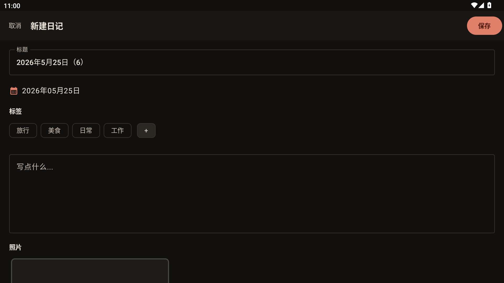
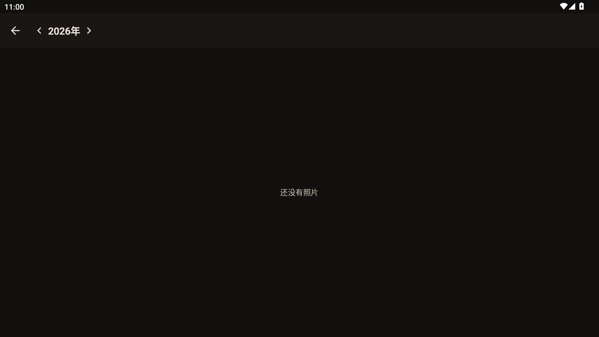

# 相册日记 (PhotoDiary)

用照片记录每一天，私密、简约、优雅的 Android 日记应用。

## 功能

- **日历视图** — 时间线嵌入月历，一目了然；支持全屏日历浏览
- **图文日记** — 标题、内容、照片（拍照/相册）、标签，日期可回溯
- **照片墙** — 按年份分组，月份瀑布流展示所有照片
- **标签系统** — 预设标签（旅行/美食/日常/工作）+ 自定义标签，支持颜色标记
- **搜索** — 标题和内容实时搜索
- **分享** — 一键生成精美分享图片
- **桌面小组件** — 4×2 今日日记概览
- **主题切换** — 浅色/深色/跟随系统，Terracotta 暖色调

## 截图





## 下载

前往 [Releases](https://github.com/finalistor/PhotoDiary/releases) 页面下载最新 APK。

## 技术栈

| 类别 | 技术 |
|------|------|
| 语言 | Kotlin |
| UI | Jetpack Compose + Material3 |
| 数据库 | Room |
| 图片加载 | Coil |
| DI | 手动注入（无 Hilt） |
| 架构 | MVVM + Clean Architecture |
| 构建 | Gradle 8.5 + AGP 8.2.2 |

## 构建

```bash
# Debug
./gradlew assembleDebug

# Release（需要 keystore.properties）
./gradlew assembleRelease
```

最低 Android 9（API 29），目标 API 34。

## 隐私

本应用所有数据（日记、照片）均存储在设备本地，不会上传到任何服务器。详见[隐私政策](PRIVACY_POLICY.md)。

## 许可

[MIT](LICENSE)
